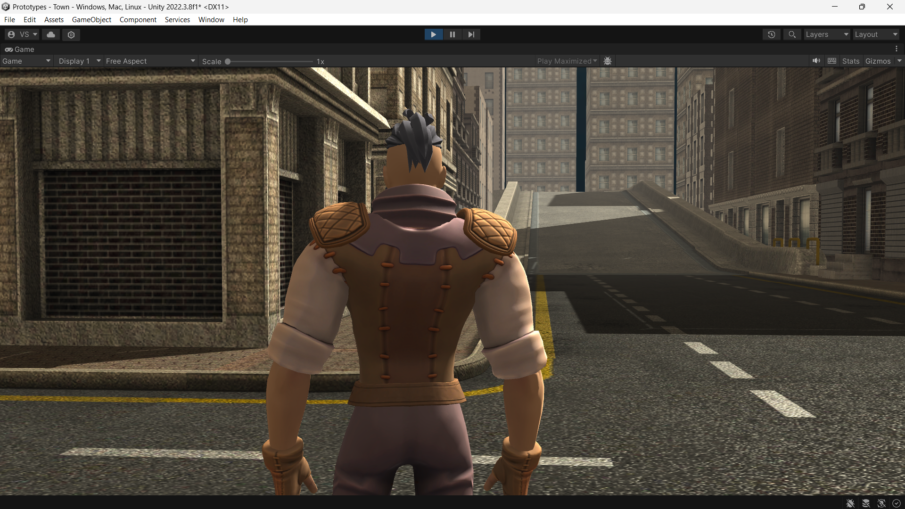
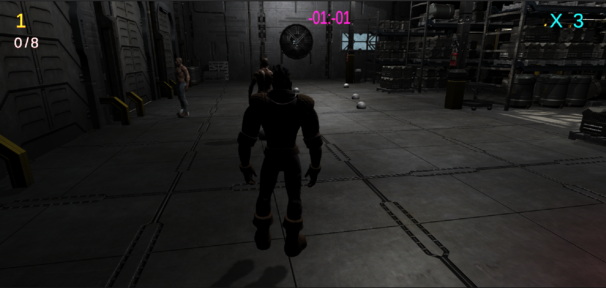

# Silent Kill

## Description
"Silent Kill" is a 3D stealth game designed to provide an immersive experience where players must eliminate enemies without being detected. The game emphasizes strategy and careful planning, allowing players to utilize unique teleportation abilities to navigate through levels and achieve their objectives.

## Features
- **Stealth Gameplay:** Emphasizes sneaking and tactical planning to take down enemies.
- **Teleportation Mechanic:** Players can throw a teleporter device and instantly move to its location, enabling creative approaches to avoiding detection and eliminating enemies.
- **Immersive Environment:** Detailed 3D environments that enhance the stealth experience and provide various hiding spots and tactical advantages.

## How to Play
1. **Clone the Repository:**
   ```bash
   git clone https://github.com/yourusername/silent-kill.git
2. Open the project in Unity and then build the application.
3. Read the instructions given in the instructions file and the start the application.
4. Use the "WASD" keys for the player movement.
5. press and hold down right mouse button a line showing the teleporter path will appear. The players can change the position and alignment of the line.
6. Press "Space" to throw the teleporter by holding down the right mouse button and then press "F key" to teleport to the position where the teleporter hit the ground.
7. To knock down the enemies get behind an enemy and press "E" to take down the enemy.

## Screenshots





## Contributing

Feel free to contribute to the project by opening issues or creating pull requests. Follow the guidelines outlined in [CONTRIBUTING.md].

## License

This project is licensed under the [MIT License] - see the [LICENSE.md] file for details.
   
